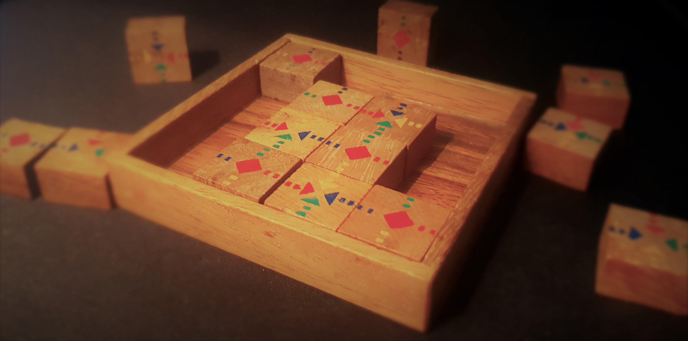
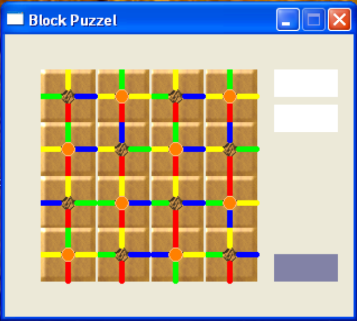

# Block Problem

In the mid 90s, I was gifted a wooden puzzle game that contains a grid array of 4x4 blocks. I've never since seen this puzzle game anywhere else.

Based on a 4x4 grid of wooden blocks, each block has a graphic on its top-side. Each graphic indicates a colour for each edge of the square. Half the blocks also contain a diamond in the centre. The other half do not.

## Visual Basic Implementation

As per the [History.txt](./doc/History.txt) file, in 2001, I implemented the blocks including data to hold the 4 colours and set the diamond flag.

The UI allows the user to swap two blocks with two clicks. And also rotate a block with a right-click.

The intention was to also include a brute force solving algorithm, however this was never started.

## Solver Implementation

In 2022, I rediscovered the physical block game again which prompted me to upload the old version I had worked on. After realising the implementation was very much incomplete, I again thought about a solver algorithm. This time I certainly wasn't going to implement a brute force version.

This time, I wanted to do this overkill style, using ideas that I am not so familiar with. This involved graph theory to define the characteristics of the game using 'nodes', and bind these nodes together using 'edges'.

I then looked at defining constraints for the different types of nodes, which make up the rules of the game.

From this data representation we can build-up permutations of possibilities that respect the data structure and constraints placed on them.

## How Graphs Solve This Puzzle

### What is a Graph?

A graph is a mathematical structure made up of two things:

- **Nodes** (also called vertices) — these represent things, objects, or states.
- **Edges** — these represent connections or relationships between nodes.

Think of it like a social network: each person is a node, and a friendship between two people is an edge. Graphs don't care about positions or coordinates — they only care about *what connects to what*.

There are different types of graphs:
- **Undirected graph** — edges work both ways (if A connects to B, then B connects to A).
- **Directed graph** — edges have a direction (A to B is not the same as B to A).
- In our solver, we use **directed edges** because "Block A can sit to the LEFT of Block B" is different from "Block A can sit ABOVE Block B".

### The Puzzle as a Graph Problem

A brute force approach would try every possible arrangement of 16 blocks in 16 positions, each at 4 rotations. That's potentially 16! x 4^16 combinations — an astronomically large number (around 85 trillion billion).

Instead, we use a **compatibility graph** to dramatically reduce the search space by pre-computing which blocks can actually sit next to each other.

### Step 1: Build the Compatibility Graph

Each block can be placed in 4 rotations (0°, 90°, 180°, 270°). So we start by listing every possible **(block, rotation)** pair — these become the **nodes** of our compatibility graph. With 16 blocks and 4 rotations each, that gives us 64 nodes.

We then draw **edges** between nodes based on whether two block orientations can legally sit adjacent:

- **Horizontal edge** (A → B): exists if Block A's **right** colour equals Block B's **left** colour. This means A can sit directly to the left of B.
- **Vertical edge** (A → B): exists if Block A's **bottom** colour equals Block B's **top** colour. This means A can sit directly above B.

For example, if Block 3 at rotation 0 has a red right edge, and Block 7 at rotation 2 has a red left edge, then we draw a horizontal compatibility edge between them. If those colours don't match, there's no edge — meaning we know immediately that these two orientations can *never* sit side by side horizontally.

This pre-computation is fast (comparing all 64 x 64 pairs) and creates a lookup table that the solver queries thousands of times during the search.

### Step 2: Constraint Propagation

With the compatibility graph built, we solve the puzzle using a technique called **Constraint Satisfaction with Backtracking**:

1. **Variables**: The 16 grid positions (row 0-3, column 0-3).
2. **Domains**: For each position, the set of valid (block, rotation) pairs that could go there.
3. **Constraints**: Adjacent positions must be connected by an edge in the compatibility graph. Each block can only be used once.

The solver fills the grid left-to-right, top-to-bottom. At each position, it only considers placements that are compatible with the **already-placed** left and top neighbours — filtering candidates through the compatibility graph's adjacency lists.

This is where the graph structure pays off. Instead of checking "does this block work here?" by comparing colours each time, we simply ask "is there an edge in the compatibility graph between what's already placed and what I'm trying to place?" — a fast set lookup.

### Step 3: Forward Checking

After placing a block, the solver looks ahead at the **next** empty positions (right neighbour, bottom neighbour) and checks whether they still have *at least one* valid candidate remaining. If placing a block leaves a future position with zero options, the solver immediately **backtracks** without exploring further — pruning dead-end branches early.

### Step 4: Duplicate Pruning

Many of the 16 blocks are identical (same type, same colours). The solver builds a **canonical block map** — for each block, it finds the lowest-index block with identical properties. When searching at a given position, if it has already tried one block and there's an identical block remaining, it skips the duplicate. This avoids redundant work that would produce the same result.

### Level 2: Diamond Constraint

Level 2 adds the rule that no two adjacent blocks can both have diamonds. The solver handles this with a **checkerboard parity** optimisation:

Since 8 of the 16 blocks have diamonds and 8 don't, and no two diamond blocks can touch, diamonds must occupy one "colour" of a checkerboard pattern (like bishops on a chess board). There are only two possible parities — diamonds on even (r+c)%2 positions or odd positions. The solver tries both, pre-filtering each position's domain to only include diamond or non-diamond blocks as appropriate. This halves the search space before backtracking even begins.

### Why This Isn't Brute Force

| Approach | What it does | Scale |
|----------|-------------|-------|
| **Brute force** | Try every permutation of blocks and rotations | ~10^25 combinations |
| **Graph solver** | Pre-compute compatibility, prune impossible branches via graph lookups, skip duplicates, forward-check future positions | Solves in milliseconds |

The key insight is that the compatibility graph encodes *all* the puzzle's rules as a data structure. The solver never wastes time on placements that violate constraints — it only explores paths where the graph says "these blocks can sit together."

## Game Levels

Level 1 challenge:
The player must place all the blocks so that adjacent blocks have matching edge colours.

Level 2 challenge (Level 1 plus):
No two blocks containing a diamond should touch, i.e., blocks with diamonds should be laid out in a checkerboard pattern with respect to blocks without diamonds.
