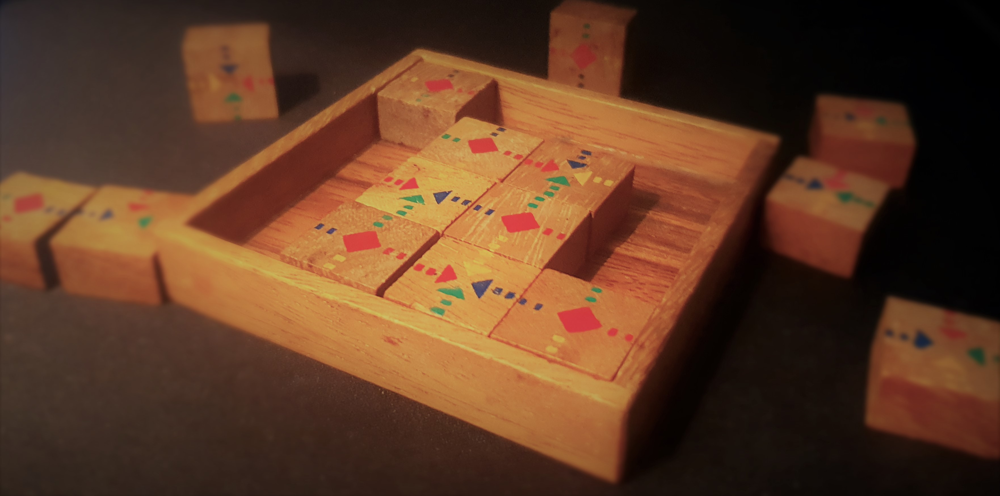

# Block Problem

In the mid 90s, I was gifted a wooden puzzle game that contains a grid array of 4x4 blocks. I've never since seen this puzzle game anywhere else.

Based on a 4x4 grid of wooden blocks, each block has a graphic on its top-side. Each graphic indicates a colour for each edge of the square. Half the blocks also contain a diamond in the centre. The other half do not.

## Visual Basic Implementation

As per the [History.txt](./doc/History.txt) file, in 2001, I implemented the blocks including data to hold the 4 colours and set the diamond flag.

The UI allows the user to swap two blocks with two clicks. And also rotate a block with a right-click.

The intention was to also include a brute force solving algorithm, however this was never started.

## Solver Implementation

In 2022, I rediscovered the physical block game again which prompted me to upload the old version I had worked on. After realising the implementation was very much incomplete, I again thought about a solver algorithm. This time I certainly wasn't going to implement a brute force version.

This time, I wanted to do this overkill style, using ideas that I am not so familiar with. This involved graph theory to define the characteristics of the game using 'nodes', and bind these nodes together using 'edges'.

I then looked at defining constraints for the different types of nodes, which make up the rules of the game.

From this data representation we can build-up permutations of possibilities that respect the data structure and constraints placed on them.

## Further game-play ramping ideas:

Level 1 challenge is that:
The player must place all the blocks so that adjacent blocks have matching edge colours.

Level 2 challenge:
Level 1 requirement plus:
No two blocks containing diamond should touch, eg, blocks with diamonds  should be laid out in checker style pattern with respect to blocks without diamonds.